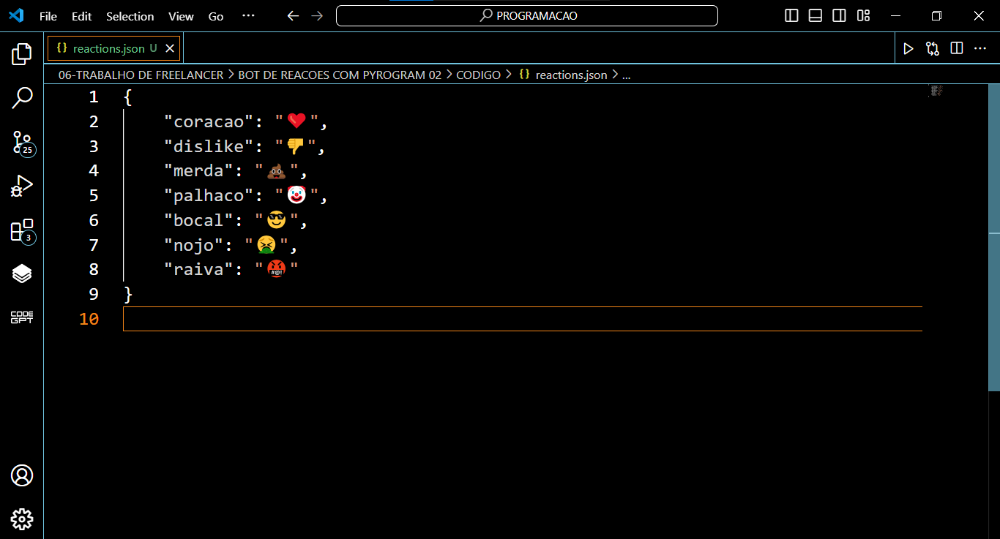
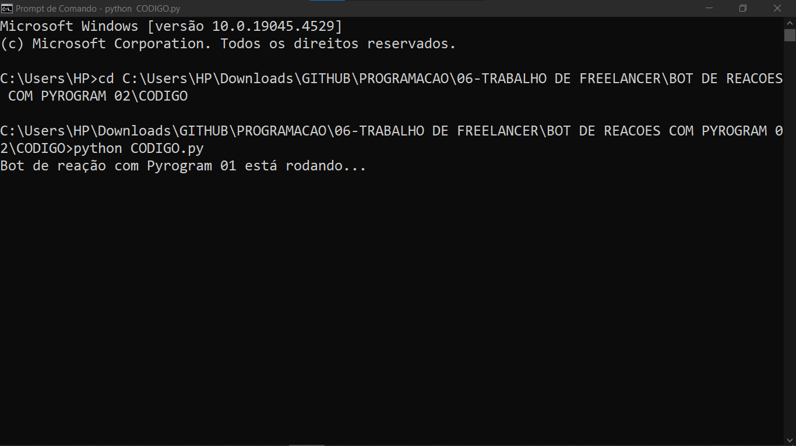

# BOT DE REACOES COM PYROGRAM 02
🛑USE SEU PERFIL PESSOAL DO TELEGRAM PARA REAGIR A UMA NOVA MENSAGEM POSTADA NOS GRUPOS AUTOMATIMANTE COM BASE EM PALAVRAS CHAVES!

 <br>
 <br>
 <br>

## DESCRIÇÃO:
O bot foi criado para facilitar a interação em grupos do Telegram ao reagir automaticamente a mensagens que contenham palavras-chave específicas. Ele utiliza emojis correspondentes às palavras-chave encontradas nas mensagens, proporcionando uma maneira divertida e expressiva de interação.

## FUNCIONALIDADES:
1. **Reação Automática:**
   - O bot monitora todas as mensagens enviadas nos grupos em que está presente.
   - Ao identificar uma palavra-chave definida no arquivo JSON de configuração (`reactions.json`), o bot envia automaticamente um emoji associado à palavra-chave como reação à mensagem.

2. **Perfil Personalizado:** 
    - O bot pode ser personalizado com o avatar do seu perfil pessoal, ao invéz de usar o avatar criado no @botfather.

## PROCEDIMENTO DE COMPRA:
- Para efetuar a compra, por favor, entre em contato comigo por mensagem privada, informando:
    ```bash
    Gostaria de adquirir o bot: https://github.com/VILHALVA/BOT-DE-REACOES-COM-PYROGRAM-02
    ```
- Após a confirmação do pagamento e o envio do comprovante, você receberá um arquivo zip contendo o código-fonte do bot, acompanhado de um manual detalhado (`MANUAL.md`), que oferece instruções abrangentes sobre a configuração do ambiente, sugestões de cursos e documentação recomendada, bem como o arquivo `HOSPEDAGEM.md`, contendo orientações para hospedar o seu bot.
- [🤑CLIQUE AQUI PARA ENTRAR EM CONTATO](https://t.me/VILHALVA100)
- [🧑‍💻PRECISA DE UM FREELANCER? CLIQUE AQUI PARA VER EM TELEGRAPH](https://telegra.ph/FREELANCER-10-19-9)
- [🧑‍💻PRECISA DE UM FREELANCER? CLIQUE AQUI PARA VER EM README](https://github.com/VILHALVA/VILHALVA/blob/main/FREELANCER/README.md)
